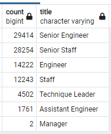
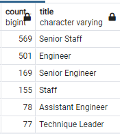

# Pewlett Hackard Employee Retirement Analysis
## Overview

The purpose of this analysis is to determine the number of retirement eligible employees at Pewlett Hackard based on job title and to provide data that will help PH management determine if a proposed mentorship program will help the company manage through a coming silver tsunami.

## Results

- There are over 90,000 employees that are currently retirement eligible
- Of those 90,000, over 1/3rd are Senior Engineers
- Detailed distribution of retirement eligible employees by job title is shown below

 

- There are 1,549 employees eligible for the proposed mentorship program
- Of those eligible, less than 1% are Senior Engineers

 

## Summary
- 90,398 roles will need to be filled as the silver tsunami begins to make an impact
- Assuming a single mentor can take on up to 3 mentees while still being an effective mentor, at least 30,000 of those eligible for retirementn would need to also be eligible for the mentorship program.  This analysis shows that only 1,549 are eligible for the mentorship program.  Based on these considerations, there are not enough mentors available to mentor the next generation of PH employees.